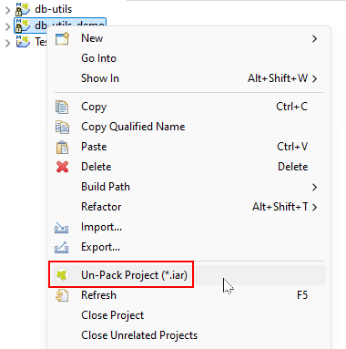
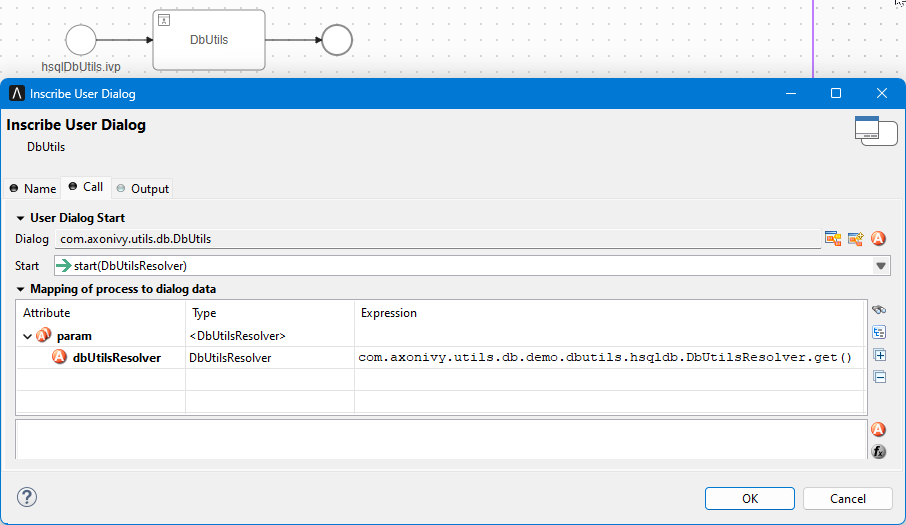
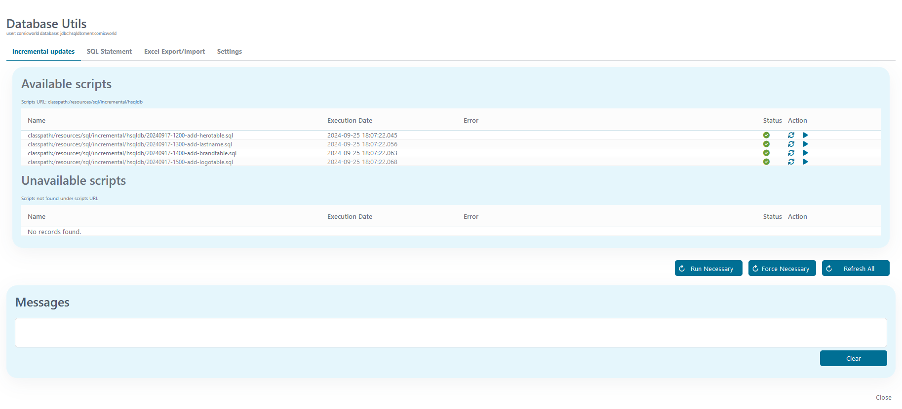
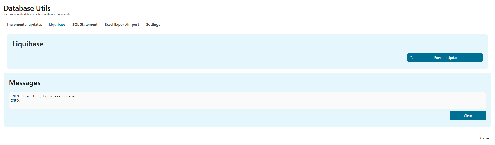
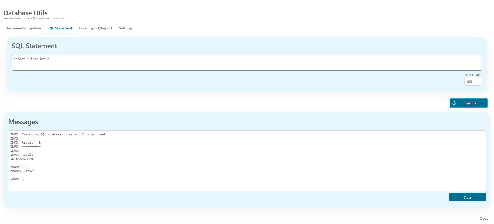
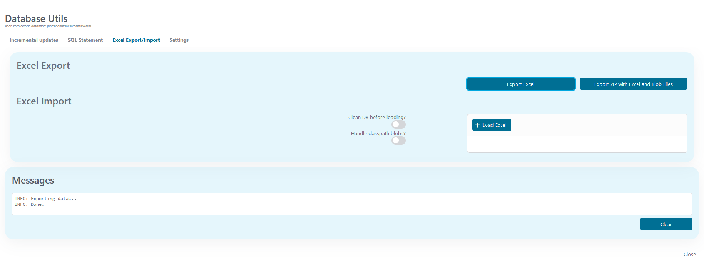
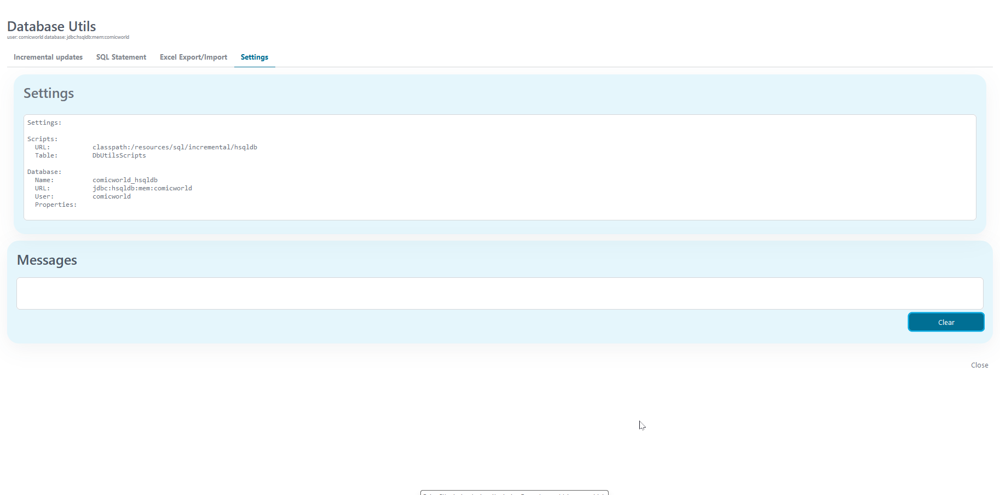
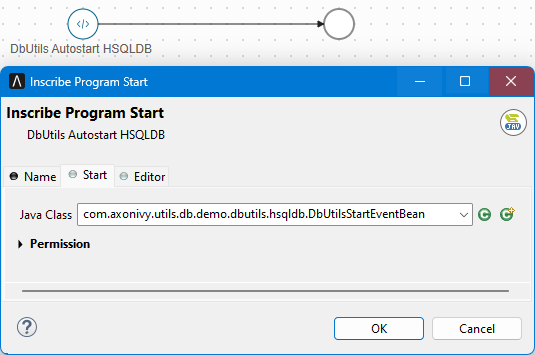

# DB-Utils

Db-Utils is a collection of tools to help with typical database tasks in your Axon Ivy project. It provides safe, guided UI flows to run incremental SQL scripts, perform migrations, and import/export data so teams can manage project databases reliably.

### Key features

- Execute and manage database scripts directly from an easy-to-use interface.
- Apply reliable, versioned database migrations with Liquibase integration.
- Run ad-hoc SQL queries and preview results without leaving the UI.
- Import and export data via Excel for fast bulk updates.
- Perform incremental updates through guided workflows to reduce risk.
- Centralize database settings and controls for consistent team usage.

## Concepts

The most important feature of DB-Utils is probably the automatic update of your database whenever you deploy. Additionally, data from your databases can be easily exported or imported into Excel or Zip files and simple queries can be executed directly from a Db-Utils GUI within your application. By defining a resolver to provide your project setup, some settings in global variables and potentially a process start event bean, you can make use of all features of DB-Utils.

### Incremental Updates

Db-Utils works by maintaining a list of incremental SQL scripts and their execution status together with your project and your project’s database. When Db-Utils is run for the first time (either through the GUI or automatically by a program start), it will create a table to maintains this list. The table name can be overridden in your `DbUtilsResolver` but the default name is `DbUtilsScripts`. Files can be executed manually from the Db-Utils GUI or automatically whenever your application starts. The SQL scripts can be stored in a file-system folder or in a resources (classpath) directory (which is the preferred way). As a convention, SQL scripts are sorted, displayed and executed in the alphabetical order of their filenames. It is recommended to put the project’s incremental files into the classpath of your project e.g. a subfolder of the `src` folder of your project (e.g. `src/resources/sql/incremental`) and follow a common pattern when naming your scripts, e.g.

`YYYYMMDD-HHMM-Ticket-Short-Description.sql`

Db-Utils creates a table to remember, which of these SQL scripts were executed and provides a GUI to display the list of scripts together with their status. Scripts can be executed, skipped and generally maintained in this GUI.

Additionally, you can define a `IProcessStartEventBean` to execute needed (not yet executed) SQL scripts automatically in the correct order during the start of your application. This `IProcessStartEventBean` can be created easily by simply extending `AbstractDbUtilsStartEventBean`. Note, that this bean must be defined in the context of your application (or depend on your projects), since it must have access to the classpath of your projects.

Note, that there is also a second database update mechanism available which is based on [Liquibase](https://liquibase.com).

### Liquibase Incremental Updates

Another database update mechanism is available and based on [Liquibase](https://liquibase.com). All that needs to be done is to define a changelog file in your `DbUtilsResolver` and if you want, implement a StartEvent bean for automatic updates during application start.
For information about Liquibase please see their official documentation!

### SQL Queries

Db-Utils offers a simple GUI to execute SQL scripts. Note, that these scripts are executed "as-is" without any checks and under the permissions of the user configured for your database. The GUI displays results in a simple text window. It is designed for quick small lookups or online fixes and does not compare to any real database tool.

### Excel Export and Import

Db-Utils offers an export and import functionality for Excel files and even binary BLOBS. This feature is implemented by [DbUnit](https://www.dbunit.org/).

**Export of data** can be done in two ways:
* *Export Excel* Export an Excel with one sheet per table
* *Export ZIP* Export an Excel with one sheet per table, but additionally export all columns representing a binary large object (BLOB) into their own file. The Excel and all exported files are stored in a ZIP file. in the ZIP file, BLOB column files are put into subfolders with the naming convention `lob/<TABLE>/<COLUMN>/file.ext`.

**Import of data** can be done with or without cleaning the database first. Note, that this is a potentially dangerous operation as deletion of entries cannot be undone. Importing data should probably only be used during tests to put a database into a defined test state or for an initial setup of your project database on a new machine.
* *Load Excel* Load an Excel in the same format as the Export creates.
* *Load Excel and handle classpath blobs* Currently, a previously exported ZIP file cannot be imported but a solution is provided which proved useful in project developments. The Import loads an Excel in the same format as Export ZIP creates but handle classpath references in Excel columns. If a column contains a classpath reference (`classpath:/path`), the file is looked up in the data resources defined for DB-Utils and the file will be inserted as a Blob. It is recommended to put the BLOB files in a subfolder of the src folder of your project (e.g. `src/data`). The assumption is, that you will only have a few seldomly changing BLOB test files in your project for testing and don't want to create ZIP files for every column change in the imported Excel during development.

To see an example of resources stored in your project, please examine the demo project `src/resources` folder and compare to the settings in global variables (or `DbUtilsResolver` for the Microsoft SQL Server part).

Note, that for importing, the sheets in your Excel must be in the right order to not break any constraints. To get the right order, it is best to export the database first. Export will create an Excel with the right sheet order.

Note, that Excel has restrictions on the maximum size of columns and sheets. This feature can be helpful for testing or for initial database setup but it should not be used for database backups and similarly "serious" database tasks.

## Demo



The demo shows how to integrate Db-Utils in your project and provides ready-to-run examples for HSQLDB and Microsoft SQL Server.

### DbUtils HSQLDB
How to launch
- Start the request named "DbUtils HSQLDB" from the application's request/start page.

What you see & steps
1. The DbUtils administration window opens, preconfigured for the HSQLDB demo instance.
2. The main view gives an overview of the demo database and presents controls for common DB tasks.
3. When you pick an operation you will be asked to confirm; the UI then shows progress and a clear success/error message.

Actions you can perform
- Inspect tables and sample data.
- Run database updates or migrations.
- Apply or revert provided demo data changes.
- Execute ad‑hoc SQL or maintenance tasks (if offered) and refresh the results/log output.

Who can run it
- Starting this demo requires the DbUtilsAdministrator role.

Notes
- The demo also includes background autostart entries (DbUtils Autostart HSQLDB and Liquibase Autostart HSQLDB) that may run on application start to prepare or update the demo database automatically.

---

### DbUtils MSSQL
How to launch
- Start the request named "DbUtils MSSQL" from the application's request/start page.

What you see & steps
1. The same DbUtils administration window opens, preconfigured for the MSSQL demo instance.
2. The main view shows MSSQL-specific connections and the same set of DB operation controls.
3. Select an action, confirm when prompted, and watch progress plus a final status message.

Actions you can perform
- Inspect tables and sample data.
- Execute database updates or migrations.
- Manage demo data (apply/revert sample changes).
- Run ad‑hoc SQL or built-in maintenance operations and review results/logs.

Who can run it
- Starting this demo requires the DbUtilsAdministrator role.

Notes
- The demo includes autostart entries (DbUtils Autostart MSSQL and Liquibase Autostart MSSQL) that may run on application start to prepare or update the MSSQL demo database.

General
- Both requests open the same DbUtils dialog, but each is preconfigured for its target database (HSQLDB or MSSQL), so the UI you see and the available operations will be appropriate for the chosen demo.

### Db-Utils GUI



Most of the Demo can be seen in the Db-Utils GUI. The GUI has tabs for different operations and a common message area to show results. To use the GUI use the `dbadmin` user or create a user having the role `DbUtilsAdministrator`.

### Incremental Updates

The **Incremental Updates** tab shows an overview of available SQL scripts and a list of scripts that are no longer available as resources. For each script the execution date, errors and a status are shown. Scripts can be manually executed, refreshed, disabled, ignored or deleted.



### Liquibase Incremental Updates

The **Liquibase** tab offers a button to start the Liquibase update. Errors will be shown on the page.



### SQL Statements

The **SQL Statements** tab can be used to execute simple SQL statements against the database. Results are shown in the message area.



### Excel Export/Import

The **Excel Export/Import** tab is used to export the whole database to an Excel or ZIP file or to import the whole database (or parts) from an Excel file. When importing, you can select to clean the database before importing. Note: this cleanup will clean all tables mentioned in the imported Excel unconditionally. It is possible to import incremental, if you do not break any database constraints.



### Settings

The **Settings** tab shows the current settings used by Db-Utils.



## Setup

To integrate and use DB-Utils in your project, you must (for every database you want to support)
- provide a project local `DbUtilsResolver` class
- provide a project local `DbUtilsStartEventBean` class
- create a start process which calls the DB-Utils GUI
- create a program start using the `DbUtilsStartEventBean`
- check configuration
- check security

### Provide `DbUtilsResolver`

The `DbUtilsResolver` keeps configuration information for a database (name, resource paths, changelog, scripts, etc.). You can extend `AbstractDbUtilsResolver` or provide your own implementation.

### Provide DbUtilsStartEventBean and/or LiquibaseStartEventBean

The `DbUtilsStartEventBean` and/or `LiquibaseStartEventBean` can be used to run automatic updates on application start by extending `AbstractDbUtilsStartEventBean` and providing a project resolver.

### Create Db-Utils GUI process start

Create a start process which uses the Db-Utils GUI (and the project's `DbUtilsResolver`). Secure this start with an elevated role in your project.


### Create Program Start

Create a program start which uses the project's `DbUtilsStartEventBean`.



### Configuration

Classes extending `AbstractDbUtilsResolver` can be configured by global variables. The most important settings include database name, scripts URL, data URL (for BLOBs), and feature toggles for tabs and autoupdate.

```
@variables.yaml@
```

### Security

Db-Utils can execute SQL directly against the configured database. Secure the Db-Utils UI with an administrative role (for example `DbUtilsAdministrator`) and avoid exposing powerful credentials in production.

## Components

### Exposed CALLABLE_SUB processes

No CALLABLE_SUB process files found.

### Form components

#### dialogs

#### DbUtilsData

- **Name Space**: com.axonivy.utils.db.DbUtils
- **Paths**:
  - xhtml: db-utils/src_hd/com/axonivy/utils/db/DbUtils/SqlStatement.xhtml
- **Component type**: HTML_DIALOG
- **Parameter**:
  - ctrl (com.axonivy.utils.db.controller.DbUtilsController)

#### DbUtilsData

- **Name Space**: com.axonivy.utils.db.DbUtils
- **Paths**:
  - xhtml: db-utils/src_hd/com/axonivy/utils/db/DbUtils/Settings.xhtml
- **Component type**: HTML_DIALOG
- **Parameter**:
  - ctrl (com.axonivy.utils.db.controller.DbUtilsController)

#### DbUtilsData

- **Name Space**: com.axonivy.utils.db.DbUtils
- **Paths**:
  - xhtml: db-utils/src_hd/com/axonivy/utils/db/DbUtils/DbUtils.xhtml
- **Component type**: HTML_DIALOG
- **Parameter**:
  - ctrl (com.axonivy.utils.db.controller.DbUtilsController)

#### DbUtilsData

- **Name Space**: com.axonivy.utils.db.DbUtils
- **Paths**:
  - xhtml: db-utils/src_hd/com/axonivy/utils/db/DbUtils/IncrementalUpdates.xhtml
- **Component type**: HTML_DIALOG
- **Parameter**:
  - ctrl (com.axonivy.utils.db.controller.DbUtilsController)

#### DbUtilsData

- **Name Space**: com.axonivy.utils.db.DbUtils
- **Paths**:
  - xhtml: db-utils/src_hd/com/axonivy/utils/db/DbUtils/ExcelExportImport.xhtml
- **Component type**: HTML_DIALOG
- **Parameter**:
  - ctrl (com.axonivy.utils.db.controller.DbUtilsController)

#### DbUtilsData

- **Name Space**: com.axonivy.utils.db.DbUtils
- **Paths**:
  - xhtml: db-utils/src_hd/com/axonivy/utils/db/DbUtils/Liquibase.xhtml
- **Component type**: HTML_DIALOG
- **Parameter**:
  - ctrl (com.axonivy.utils.db.controller.DbUtilsController)

#### components

#### ScriptTableData

- **Name Space**: com.axonivy.utils.db.ScriptTable
- **Paths**:
  - xhtml: db-utils/src_hd/com/axonivy/utils/db/ScriptTable/ScriptTable.xhtml
- **Component type**: HTML_DIALOG
- **Parameter**:
  - ctrl (com.axonivy.utils.db.controller.ScriptTableController)

---

### Open API resources

- No public OpenAPI specs are available for this product

### Maven artifacts

1. db-utils

```xml
<dependency>
  <groupId>com.axonivy.utils.db</groupId>
  <artifactId>db-utils</artifactId>
  <type>iar</type>
</dependency>
```
2. db-utils-demo

```xml
<dependency>
  <groupId>com.axonivy.utils.db</groupId>
  <artifactId>db-utils-demo</artifactId>
  <type>iar</type>
</dependency>
```
