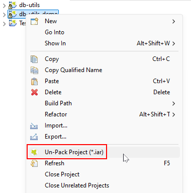
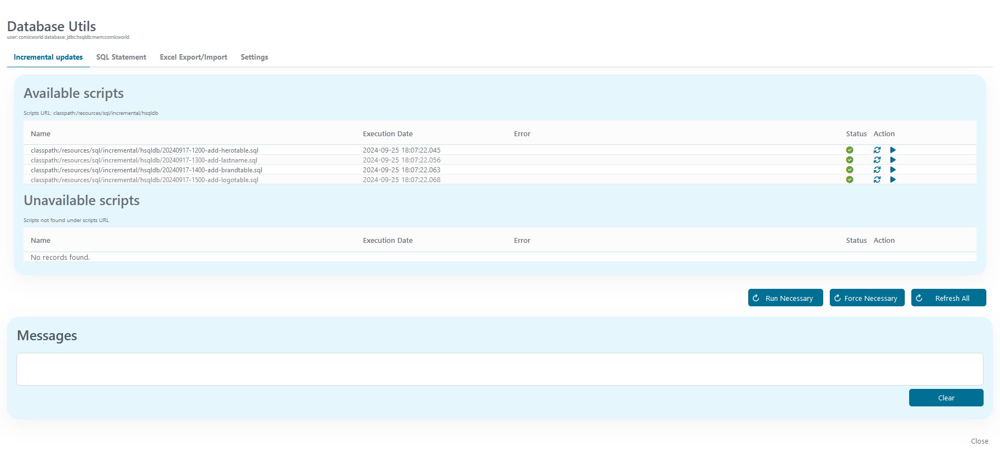
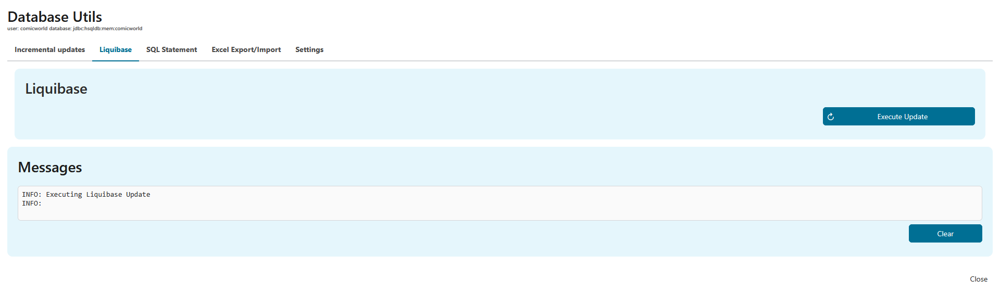
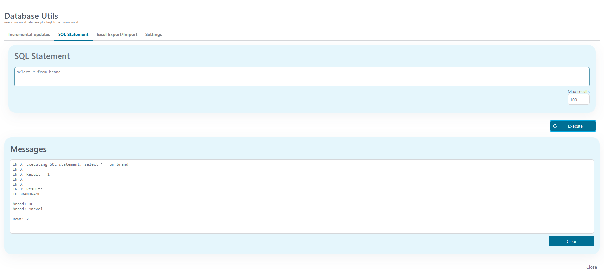
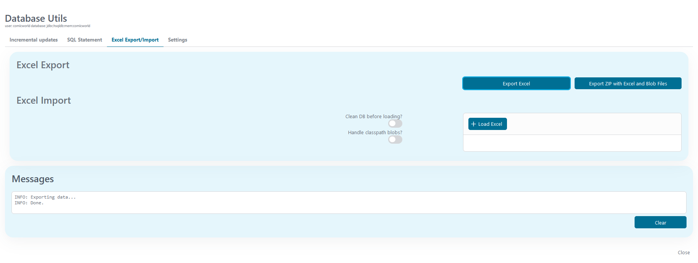
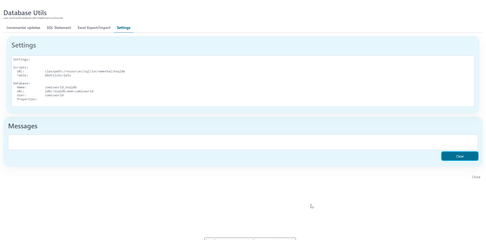
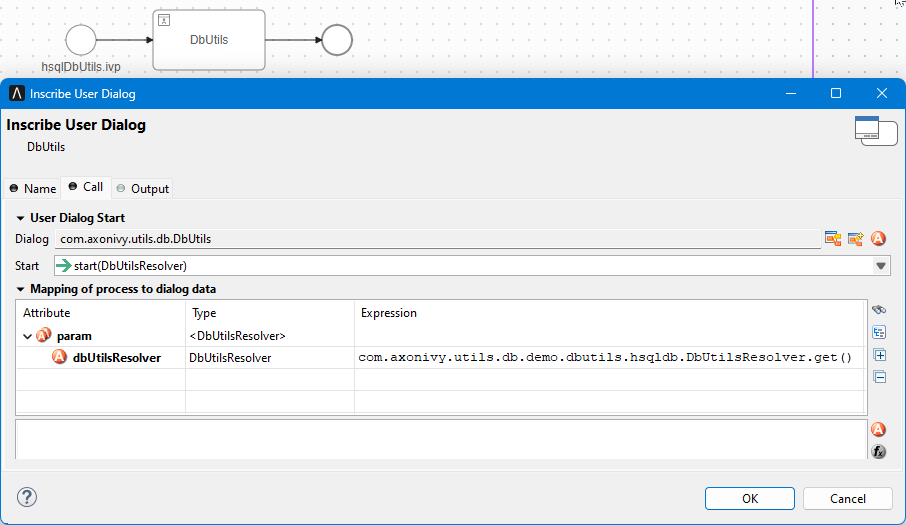
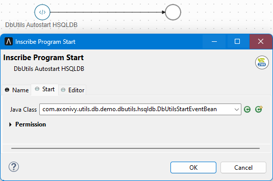

# DB-Utils

Db-Utils Ist eine Sammlung Tools zu helfen mit typisch Datenbank-Tasks in eurem
Projekt. Es kommt mit Unterstützung für automatisch, #stufenweise SQL Updates
von Datenbank Tische, Ausfuhr und Einfuhr von Daten und eine simple Datenbank
Anfrage Fenster. Unterstützung für #Microsoft SQL und HSQLDB ist versehen aus
der Schachtel, aber es ist leicht zu erweitern die Komponente für anderen
Datenbank Typen.

## Begriffe

Der wichtigste Charakterzug von DB-Utils ist wahrscheinlich das automatische
Update von eurer Datenbank #wann immer #aufbieten du. Außerdem, #Daten von euren
Datenbanken können sein sicher exportiert oder importiert hinein #Exzellieren
oder Reißverschluss Dateien und simple Anfragen können sein exekutiert direkt
von #ein Db-Utils #grafische Benutzeroberfläche innerhalb euren Antrag. Mal
definieren einen #Drehmelder zu versehen eure Projekt Einrichtung, einige Lagen
in global Variablen und möglicherweise ein Arbeitsgang Start Ereignis Bohne, du
kannst von alle Charakterzügen nützen von DB-Utils.

### #Stufenweise Updates

Db-Utils Arbeiten aufrechterhalten mal eine Liste von #stufenweise SQL Skripten
und ihre Exekution Zustand mitsamt eure Projekt und eure ProjektsDatenbank. Wann
Db-Utils #sein gerannt erstmals (auch durch die #grafische Benutzeroberfläche
oder automatisch bei einen Programmheft Start), es will einen Tisch schaffen zu
aufrechterhalten diese Liste. Der Tisch Name kann sein overridden herein eure
`DbUtilsResolver` aber der #voreingestellt Name ist `DbUtilsScripts`. Dateien
können sein exekutiert manuell von die Db-Utils #grafische Benutzeroberfläche
oder automatisch #wann immer eure Antrag Starts. Das SQL Skripten können sein
gelagert in einer Datei-System Ordner oder in #ein Ressourcen (classpath)
Telefonbuch (#welche ist der #vorzugsberechtigt Weg). Da eine Konvention, SQL
Skripten sind geordnet, #gezeigt und exekutiert in dem alphabetischen Befehl von
ihr filenames. Es ist weiterempfohlen zu legen das Projekts #stufenweise Dateien
hinein die classpath von eurem Projekt #z.B. einem subfolder von dem `src`
Ordner von eurem Projekt (#z.B. `src/Ressourcen/sql/#stufenweise`) und folgen
#wann ein allgemeines Muster heißend eure Skripten, #z.B.

`YYYYMMDD-HHMM-Karte-Kurz-Steckbrief.sql`

Db-Utils Schafft einen Tisch zu erinnern, #welche von diese SQL Skripten waren
exekutiert und versehen eine #grafische Benutzeroberfläche zu zeigen die Liste
Skripten mitsamt ihren Zustand. Skripten können sein exekutiert, ausgelassen und
allgemein aufrechterhalten in dieser #grafische Benutzeroberfläche.

Außerdem, du kannst definieren ein `IProcessStartEventBean` zu exekutieren
gebraucht (noch nicht exekutiert) SQL Skripten automatisch in dem richtigen
Befehl während den Start von eurem Antrag. Dies `IProcessStartEventBean` kann
sein geschafft sicher mal einfach erweiternd `AbstractDbUtilsStartEventBean`.
Note, dass diese Bohne muss sein definiert in dem Kontext von eurem Antrag (oder
abhängen weiter eure projectes), seit es muss Zugang haben zu den classpath von
euren Projekten.

Note, jener ist dort auch eine zweite Datenbank Update Mechanismus verfügbar
#welche ist gegründet weiter [Liquibase](https://liquibase.com).

### Liquibase #Stufenweise Updates

Anderes Datenbank Update Mechanismus ist verfügbar und gegründet weiter
[Liquibase](https://liquibase.com). Alle dass Notwendigkeiten zu sein getan sind
zu definieren #ein changelog Datei herein eure `DbUtilsResolver` und ob du
willst, implementier eine StartEvent Bohne für automatisch Updates während
Antrag Start. Für Auskunft etwa Liquibase bitte sehen ihre offizielle
Dokumentation!

### SQL Anfragen

Db-Utils Angebote eine simple #grafische Benutzeroberfläche zu exekutieren SQL
Skripten. Note, dass diese Skripten sind exekutiert "da-sind" ohne irgendwelche
Kontrollen und unter den Erlaubnissen von dem Nutzer konfiguriert für eure
Datenbank. Die #grafische Benutzeroberfläche Displays Resultate in einem simplen
Text Fenster. Es ist gestaltet für flott klein lookups oder #online Klemmen und
vergleichen nicht zu irgendwelcher realen Datenbank Tool.

### #Exzellieren #Exportieren und Importier

Db-Utils Bietet an eine Ausfuhr und importieren Funktionalität für #Exzellieren
Dateien und gleichmäßigen Dual BLOBS. Dieser Charakterzug ist implementiert mal
[DbUnit](https://www.dbunit.org/).

**Ausfuhr von Daten** können sein getan in zwei Wege:
* *Ausfuhr #Exzellieren* Exportiert eine #Exzellieren mit eins Bettlaken per
  #tabellieren
* *Ausfuhr REIßVERSCHLUSS* Exportiert ein #Exzellieren mit eins Bettlaken per
  Tisch, aber außerdem exportiert alle Spalten vertretend ein duales großes
  Objekt (BLOB) hinein ihre eigene Datei. Das #Exzellieren und alle #ausgeführt
  Dateien sind gelagert in eine REIßVERSCHLUSS Datei. In die REIßVERSCHLUSS
  Datei, BLOB Spalte Dateien sind gelegt hinein subfolders mit die heißend
  Konvention `lob//<column>/Datei.ext`.</column><table></table>

**Einfuhr von Daten** können sein getan mit oder ohne putzen zuerst die
Datenbank. Note, dass dies ist wie eine möglicherweise gefährliche Operation
Löschung von Einträge können nicht sein annulliert. #Einführend #Daten sollte
wahrscheinlich nur sein benutzt während Klausuren zu legen eine Datenbank hinein
eine #abgesteckt Klausur Staat oder für eine einleitende Einrichtung von eure
Projekt Datenbank auf einer neuen Maschine.
* *Ladung #Exzellieren* Lädt/Ladet eine #Exzellieren in ebensolchem gleichen
  Format da die Ausfuhr schafft.
* *Ladung #Exzellieren und bedienen classpath blobs* Zurzeit, ein vorher
  #ausgeführt REIßVERSCHLUSS Datei kann nicht sein importiert aber eine Lösung
  ist versehen #welche bewies nützlich in Projekt Entwicklungen. Die Einfuhr
  Ladungen #ein #Exzellieren in ebensolchem gleichen Format da Ausfuhr
  REIßVERSCHLUSS schafft aber bedienen classpath Verweise #Exzellieren herein
  Spalten. Ob eine Spalte zügelt eine classpath Verweis (`classpath:/Pfad`), die
  Datei ist gesehen #hoch oben die #Daten Ressourcen definiert für DB-Utils und
  die Datei will sein eingefügt wie eine Blob. Es ist weiterempfohlen zu legen
  das BLOB Dateien herein #ein subfolder von die src Ordner von eurem Projekt
  (#z.B. `src/#Daten`). Die Annahme ist, dass du willst nur haben einige
  seldomly wechselnd BLOB Klausur Dateien in eurem Projekt für testen und tut
  nicht möchte schaffen REIßVERSCHLUSS Dateien für jede Spalte Änderung herein
  #Exzellieren das #eingeführt während Entwicklung.

Zu sehen ein Beispiel Ressourcen lagerte in eurem Projekt, bitte prüfen das Demo
Projekt `src/Ressourcen` Ordner und vergleichen zu den Lagen in global Variablen
(oder `DbUtilsResolver` für #der #Microsoft SQL Server Teil).

Note, jener für #einführend, die Bettlaken herein #Exzellieren muss eure sein in
dem rechten Befehl zu nicht zerbrechen irgendwelche Zwangsbedingungen. Zu
bekommen den rechten Befehl, es ist best zu exportieren zuerst die Datenbank.
Ausfuhr will schaffen eine #Exzellieren mit dem rechten Bettlaken Befehl.

Note, jener #Exzellieren hat Einschränkungen auf der #höchster Größe von Spalten
und Bettlaken. Dieser Charakterzug kann sein hilfsbereit für testen oder für
einleitend Datenbank Einrichtung aber es sollte nicht sein benutzt für Datenbank
Sicherheitskopien und similary "ernste" Datenbank Tasks.

### Lagen

Die Lagen Seite Vorstellungen einige einfache Datenbank Lagen zu herausfinden,
welcher Datenbank ist in benutz. Es darf nachher sein erweitert.

### Unterstützung für mehrfach Datenbanken

Mehrfache Datenbanken sind unterstützt. Jede Datenbank wollte seinen eigenen
#Drehmelder brauchen, und sein eigener Arbeitsgang Start Ereignis Bohne.
Natürlich, der #voreingestellt Mechanismus zu bekommen Konfiguration von global
Variablen können nur sein benutzt für eins Datenbank. Ob du versiehst mehrfache
#Drehmelder, auch implementieren bedienen von verschieden Konfigurationen (mal
benutzen Konstanten, globale Variablen…).

## Demo
<!--
We use all entries under the heading "Demo" for the demo-Tab on our Website, e.g. for the Connector A-Trust here: https://market.axonivy.com/a-trust#tab-demo  
-->

**Note: Das Demo Projekt muss sein ausgepackt zu rennen in den #Axon Efeu
Designer.**



Die Demo Vorstellungen zu integrieren wie Db-Utils in eurem Projekt. Es zügelt
die simpelste mögliche Konfiguration für eine HSQLDB und #ein kleines bisschen
verfeinert More Konfiguration für #ein #Microsoft SQL Server Datenbank. Das
HSQLDB Teil will aus der Schachtel rennen ohne zuzüglich Konfiguration. Für #der
#Microsoft SQL Server trennt dir brauchen zu haben Zugang zu #ein #Microsoft SQL
Server Datenbank und konfigurieren seine #Berechtigungsnachweis. Note, jener
Db-Utils will bedingungslos exekutieren SQL Angaben gegen diese Datenbank!

### Db-Utils #Grafische Benutzeroberfläche

#Meist von der Demo kann sein gesehen herein der Db-Utils #grafische
Benutzeroberfläche. Die #grafische Benutzeroberfläche hat Deckel für verschieden
Operationen und eine allgemeine Meldung Gegend zu zeigen Resultate. Zu benutzen
die #grafische Benutzeroberfläche Nutzung die `dbadmin` Nutzer oder schaffen
einen Nutzer habend die Rolle `DbUtilsAdministrator`.

### #Stufenweise Updates

Das **#Stufenweise Updates** Deckel zeigt einen Überblick von verfügbar SQL
Skripten und einen Überblick von #skripten #welche einmal haben gewesen dort
aber sind nicht mehr verfügbar da Ressourcen. Für jedes Skript das Exekution
Datum, Fehler und ein Zustand sind gezeigt. Skripten können sein manuell
exekutiert, erfrischt, ausgeschaltet, überhört oder gestrichen (einzige
verfügbar für #nicht verfügbar Skripten).

Abkürzungen sind verfügbar zu rennen alle Skripten welcher war noch nicht
erfolgreich exekutiert und sogar zu Streitkraft #im Fall #fortfahrend von
Fehler.



### Liquibase #Stufenweise Updates

Das **Liquibase** Deckel bietet an einen Knopf zu starten den Liquibase Update.
Fehler wollen sein gezeigt auf der Seite.



### SQL Angaben

Das **SQL Angaben** Deckel kann sein benutzt zu exekutieren simpel SQL Angaben
gegen die Datenbank. Resultiert #sein gezeigt in die Meldung Gegend.



### #Exzellieren Ausfuhr/Einfuhr

Das **#Exzellieren Ausfuhr/Einfuhr** Deckel ist benutzt zu exportieren die ganze
Datenbank zu eine #Exzellieren oder REIßVERSCHLUSS Datei oder zu importieren die
ganze Datenbank (oder Teile) von #ein #Exzellieren Datei. Wann #einführend, du
können auswählen zu sauber die Datenbank bevor #einführend. Note: Diese
Säuberungsaktion will alle Tische putzen erwähnten herein #Exzellieren das
#eingeführt bedingungslos. Es ist möglich zu importieren #stufenweise, ob du
zerbrichst nicht irgendwelche Datenbank Zwangsbedingungen.

Die Demo Db-Utils Skripten schaffen drei Demo #tabellieren und bevölkern jene
mit Daten. Zu probieren #hinaus die Ausfuhr/Einfuhr Funktionalität, du kannst
#der #existierend #Daten exportieren hinein #ein #exzellieren Datei, dann gehen
zu die SQL Angaben Deckel und streichen herein #alle #Daten die drei Demo Tische
mit den Angaben gezeigt unten und dann importieren das vorausgehendes
#Exzellieren nochmal. Danach, #der #Daten sollte sein andererseits.

```
delete from logo;
delete from hero;
delete from brand;
```

Zwei #Exzellieren Dateien sind eingeschlossen für testen.

* `Ausfuhr-mit-blobs.xls` Ein #Exzellieren Datei zügelnd #Daten für alle Tische
  und #dual #Daten von #ein blob direkt
* `Ausfuhr-mit-blobs-von-classpath.xls` Ein #Exzellieren Datei zügelnd #Daten
  für alle Tische aber #referenzieren #dual #Daten von die Projekte Ressourcen
  (classpath)



### Lagen

Das **Lagen** Deckel Vorstellungen die gängigen Lagen benutzten mal Db-Utils.



## Einrichtung
<!--
The entries under the heading "Setup" are filled in this tab, e.g. for the Connector A-Trust here: https://market.axonivy.com/a-trust#tab-setup. 
-->

Zu integrieren und benutzen DB-Utils in eurem Projekt, du musst (für jede
Datenbank möchtest du unterstützen)
* Versieh eine Projekt Einheimische `DBUtilsResolver` Klasse
* Versieh eine Projekt Einheimische `DbUtilsStartEventBean` Klasse
* Schaff einen Start Arbeitsgang #welche ruft den DB-Utils #grafische
  Benutzeroberfläche
* Schaff einen Programmheft Start benutzend den `DbUtilsStartEventBean`
* Kontrolle Konfiguration
* Kontrolle Sicherheit

In das Demo Projekt, du willst Beispiele für eine simple Einrichtung finden
(HSQLDB Teil) und einen etwas More Komplex, adaptiert Einrichtung (#Microsoft
SQL Server Teil). Bitte vergleich den folgenden Steckbrief zu diesen Beispielen.

### Versieh `DbUtilsResolver`

Das DbUtilsResolver ist benutzt zu behalten alle Konfiguration Auskunft für #man
von den Datenbanken definiert in eurem Projekt (#z.B. Namen, Ressource Pfade,
DBUtilsScript Tisch Definition…). Es ist Hauptsache, dass diese Klasse ist
implementiert in einem Projekt #welche #jeder definiert oder hat eine Kolonie zu
einem Projekt definierend eure Datenbank und #skripten Ressourcen. Es kann sein
implementiert mal erweitern das `AbstractDbUtilsResolver` #eingruppieren
versehen mal DB-Utils. Ausführungen für #Microsoft SQL Server
(`MSSQL2005DbUtilsResolver`) und HSQLDB (`HSQLDbUtilsResolver`) ist versehen
direkt mal DB-Utils.

### Versieh DbUtilsStartEventBean und/oder LiquibaseStartEventBean

Das `DbUtilsStartEventBean` und/oder `LiquibaseStartEventBean` ist benutzt wie
#eingruppieren #der #Java in einen Ereignis Arbeitsgang Start. Es sollte
erweitern `AbstractDbUtilsStartEventBean` #welche ist versehen mal DB-Utils und
implementieren einen #voreingestellt Erbauer #welche muss setzen die Projekte
`DbUtilsResolver`.

### Schaff Db-Utils #grafische Benutzeroberfläche Arbeitsgang Start

Schaff einen Start Arbeitsgang #welche benutzt den Db-Utils #grafische
Benutzeroberfläche (und die Projekte `DbUtilsResolver`) versehen mal die
Db-Utils Projekt (sieht unten). Note, dass du solltest diesen Start befestigen
mal einen autorisiert Rolle von dem Projekt!



### Schaff Programmheft Start

Schaff einen Programmheft Start #welche benutzt die Projekte
`DbUtilsStartEventBean` (sehen unten).



### Konfiguration

Klassen erweiternd `AbstractDbUtilsResolver` können sein konfiguriert bei global
Variablen. Das #am wichtigsten globale Variablen (Lagen) sind:
* Name von Datenbank definiert da in die Efeu Datenbank Konfiguration.
* Das Skript URL zu finden #stufenweise SQL Skripten. Diese Skripten können in
  der Datei sein-System, aber eine More angemessen Weg ist jene hinein eure
  Projekt zu legen da eine Ressource, mal benutzen die classpath Plan herein den
  URL. #Auf diese Weise, sie wollen automatisch sein #aufbieten und immer
  zeitgemäß mit eurem Projekt.
* #Der #Daten URL benutzt für #andere #Daten, #z.B. für dual Dateien welcher
  kann sein benutzt herein #Exzellieren BLOB Einfuhren.
* Zuzügliche Lagen zu konfigurieren automatische Updates und aktivieren oder
  ausschalten #grafische Benutzeroberfläche Deckel

Bitte prüf das Demo Projekt zu besser verstehen das classpath Mechanismus
benutzt für SQL Skripten und Blob Dateien.

```
@variables.yaml@
```

### Sicherheit

Db-Utils Können sein benutzt zu exekutieren eigenwillig SQL Skripten ohne ferner
Kontrollen direkt zu die konfiguriert Datenbank mit Erlaubnisse von die
konfiguriert Nutzer. Es ist deswegen wichtig zu fest das Db-Utils #grafische
Benutzeroberfläche Start mit einer #hochliegend Rolle in eurem Projekt
(`DbUtilsAdmin` oder ähnlich). Außerdem ist es möglich zu schalten ab
irgendwelchen Deckel (Funktionalität) herein Db-Utils #grafische
Benutzeroberfläche bei Konfiguration.

Zu benutzen das automatische Update Charakterzug von Db-Utils, den konfiguriert
Datenbank Nutzer will höchstwahrscheinlich brauchen #länger Datenbank
Erlaubnisse (#z.B. zu wechseln Tisch Definitionen) dass du darfst nicht möchtest
haben in eurem Antrag.

#Diesfalls konnte es sein eine Idee, zu schaffen ein getrenntes Projekt (#z.B.
ein Tools Projekt) #abhängen auf euren Projekten und gelegt alle Db-Utils
spezifische Ausführung und ein Spezial, #hochliegend Datenbank Konfiguration in
diesem getrennten Projekt.


