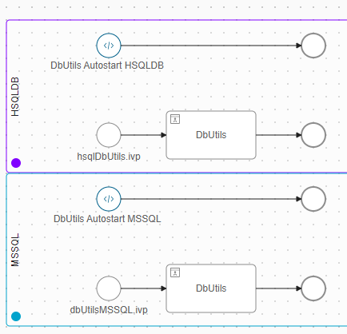
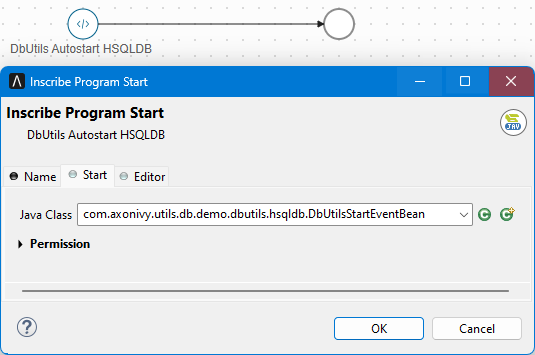
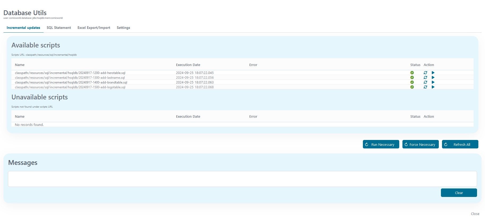
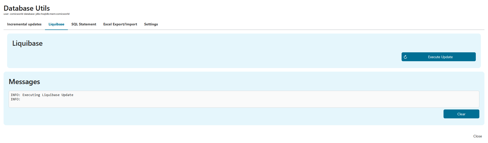
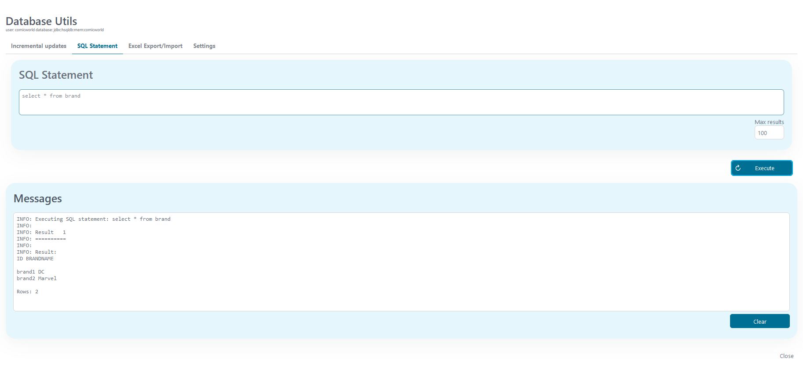
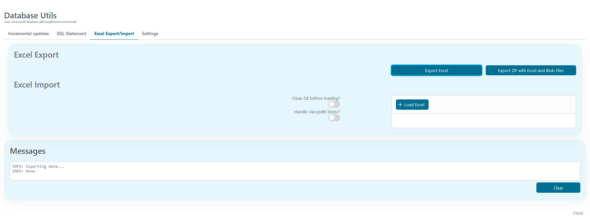
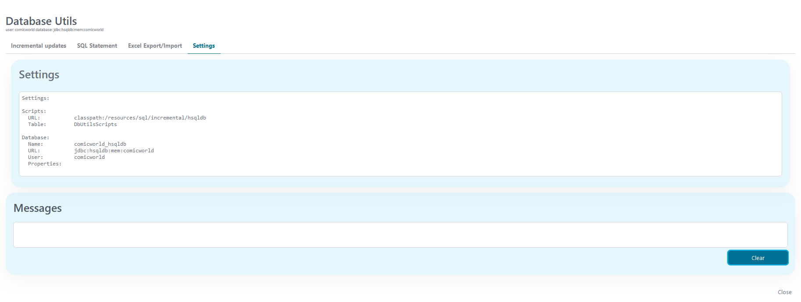
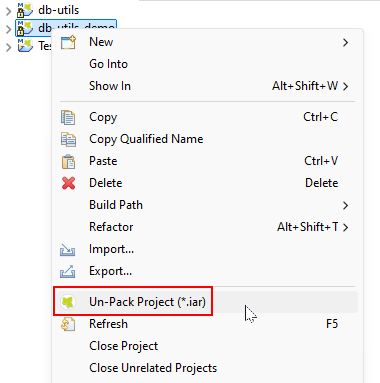

# DB-Utils

DB-Utils ist eine Sammlung von Werkzeugen, die bei typischen Datenbankaufgaben in deinem Projekt helfen. Es bietet automatische, inkrementelle SQL‑Updates für Datenbanktabellen, Export‑ und Importfunktionen für Daten sowie ein einfaches Abfragefenster. Unterstützung für Microsoft SQL und HSQLDB ist standardmäßig enthalten; die Komponente lässt sich leicht für weitere Datenbanktypen erweitern.

Sieh dir unsere [Dokumentation](db-utils-product/README.md) an.




## Wichtigste Funktionen

- Halte deine Datenbankschemata mit automatischen, inkrementellen SQL‑Updates aktuell und reduziere dadurch manuellen Migrationsaufwand.
- Importiere und exportiere Datensätze per Excel für schnellen Datentransfer zwischen Umgebungen.
- Führe Ad‑hoc‑SQL‑Abfragen aus und überprüfe die Ergebnisse im integrierten Abfragefenster.
- Unterstützt Microsoft SQL und HSQLDB direkt; Erweiterung auf weitere Datenbanken ist einfach möglich.
- Bietet eine benutzerfreundliche Admin‑UI mit Registerkarten für inkrementelle Updates, Liquibase‑Integration, SQL‑Ausführung, Excel‑Import/Export und Einstellungen.
- Ermöglicht automatische Start‑Updates und Demo‑Workflows für schnelle Evaluierung und Bereitstellung.

## Demo

Sieh dir die Demo‑Implementierungen im Modul `db-utils-demo` an. Sie enthalten HSQLDB‑ und MSSQL‑Demos, die Autoupdate, Liquibase‑Integration und den DbUtils‑Dialog demonstrieren. Diese Demos helfen dir, die Funktionen schnell zu evaluieren und zu integrieren.




### Demo‑Workflows

#### Db Utils Demo (db-utils-demo)

##### DbUtils HSQLDB

1. Starte die Demo über das Demo‑Menü oder das Dashboard.
2. Es öffnet sich der DbUtils‑Dialog mit Registerkarten für Inkrementelle Updates, Liquibase, SQL‑Anfragen, Excel‑Import/Export und Einstellungen.
3. Verwende die Registerkarte 'Incremental Updates' oder 'Liquibase', um Schema‑Updates anzuwenden, oder nutze die 'SQL Statement'‑Registerkarte für Ad‑hoc‑Abfragen.
4. Prüfe die Ergebnisse und Protokolle im Bereich "Messages"; Autostart kann Updates beim Start automatisch anwenden.

##### DbUtils MSSQL

1. Starte die Demo über das Demo‑Menü oder das Dashboard.
2. Der DbUtils‑Dialog erscheint mit denselben Registerkarten (Inkrementelle Updates, Liquibase, SQL‑Anfragen, Excel‑Import/Export, Einstellungen).
3. Führe Aktionen aus, z. B. inkrementelle Updates, SQL‑Anfragen oder Excel‑Import/Export.
4. Überprüfe die Ergebnisse und Bestätigungsnachrichten in der Benutzeroberfläche.

## Einrichtung

- **Rollen:** Everybody (konfiguriert in config/roles.xml)

- **OpenAPI:** Keine öffentlichen OpenAPI‑Spezifikationen werden von dieser Erweiterung bereitgestellt.














### Variablen

```yaml
# yaml-language-server: $schema=https://json-schema.axonivy.com/app/12.0.0/variables.json
# == Variables ==
# 
# You can define here your project Variables.
# If you want to define/override a Variable for a specific Environment, 
# add an additional ‘variables.yaml’ file in a subdirectory in the ‘Config’ folder: 
# '<project>/Config/_<environment>/variables.yaml
#
Variables:
  com:
    axonivy:
      utils:
        db:
          # name of database
          database: ""
          # URL to find scripts (supported are file: and classpath: URLs)
          scriptsurl: "classpath:/resources/sql/incremental"
          # URL to find blob data files (supported are classpath: URLs)
          dataurl: "classpath:/resources/data"
          # resource path of liquibase changelog file
          liquibasechangelog: "/resources/liquibase/changelog.yaml"
          # should the update scripts be automatically updated and executed at application start?
          autoupdate: true
          # should the tab to run incremental scripts be shown?
          incrementaltab: true
          # should the tab to execute SQL commands be shown?
          sqlstatementtab: true
          # should the tab to execute Excel export/import be shown?
          excelexportimporttab: true
```

- Für diesen Abschnitt wurden keine Informationen geliefert.

## Komponenten

### Connector‑Prozesse

- Für diesen Abschnitt wurden keine Informationen geliefert.

### Formularkomponenten

#### DbUtilsData — Datenmodell für den DbUtils‑HTML‑Dialog
- **Namespace:** com.axonivy.utils.db.DbUtils
- **Komponententyp:** Data Class (verwendet vom HTML_DIALOG)
- **Felder:**
   - `ctrl` (com.axonivy.utils.db.controller.DbUtilsController) — Controller‑Instanz, die von der UI verwendet wird, um mit den DB‑Utilities zu interagieren
- **Verwendet in:** DbUtilsProcess.p.json

#### ScriptTableData — Datenmodell für die ScriptTable‑Komponente
- **Namespace:** com.axonivy.utils.db.ScriptTable
- **Komponententyp:** Data Class / JSF Composite
- **Felder:**
   - `ctrl` (com.axonivy.utils.db.controller.ScriptTableController) — Controller, der die Skripttabelle darstellt und Skripte ausführt
- **Verwendet in:** ScriptTableProcess.p.json, ScriptTable.xhtml

### Maven‑Artefakte

1. db-utils

```xml
<dependency>
  <groupId>com.axonivy.utils.db</groupId>
  <artifactId>db-utils</artifactId>
  <version>@version@</version>
  <type>iar</type>
</dependency>
```

2. db-utils-demo

```xml
<dependency>
  <groupId>com.axonivy.utils.db</groupId>
  <artifactId>db-utils-demo</artifactId>
  <version>@version@</version>
  <type>iar</type>
</dependency>
```
