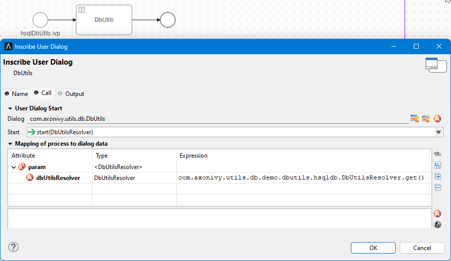

# DB-Utils

Db-Utils ist eine Sammlung von Werkzeugen, die typische Datenbankaufgaben in deinem Projekt erleichtern. Sie unterstützt automatische, inkrementelle SQL-Updates von Datenbanktabellen, den Export und Import von Daten sowie ein einfaches SQL-Abfragefenster. Unterstützung für Microsoft SQL und HSQLDB ist standardmäßig enthalten; die Komponente lässt sich leicht für weitere Datenbanktypen erweitern.



## Wichtigste Funktionen

- Führe inkrementelle SQL-Updates automatisch aus, damit deine Datenbankschemata synchron bleiben.
- Führe Ad-hoc-SQL-Abfragen direkt in der UI zur Fehlersuche und Diagnose aus.
- Importiere und exportiere Datensätze per Excel für schnelle Datenmigration und Berichte.
- Führe Liquibase-basierte Migrationen mit optionaler Autostart-Funktion aus.
- Verwalte und führe Datenbankskripte über eine Skripttabelle aus (ausführen/aktualisieren/aktivieren).
- Unterstützt HSQLDB und Microsoft SQL Server von Haus aus und lässt sich leicht erweitern.

## Demo

Probiere die enthaltenen Demos aus, um Db-Utils mit HSQLDB und MSSQL zu verwenden.

### Demo-Workflows

#### db-utils-demo (db-utils-demo)

##### DbUtils HSQLDB

1. Starte die Demo "DbUtils HSQLDB" über das Demo-Menü.
2. Der DbUtils-Dialog öffnet sich mit Registerkarten für Inkrementelle Updates, Liquibase, SQL-Anweisungen, Excel Import/Export und Einstellungen.
3. Verwende die Registerkarte Inkrementelle Updates, um inkrementelle SQL-Updates aus dem konfigurierten Script-Verzeichnis anzuwenden.
4. Nutze die SQL-Anweisungen-Registerkarte, um Ad-hoc-Abfragen auszuführen und die Ausgabe im Nachrichtenbereich zu prüfen.
5. Optional: Verwende die Excel Import/Export-Registerkarte zum Importieren oder Exportieren von Datensätzen.

##### DbUtils MSSQL

1. Starte die Demo "DbUtils MSSQL" über das Demo-Menü.
2. Der DbUtils-Dialog öffnet sich mit denselben Registerkarten, konfiguriert für MSSQL.
3. Nutze Liquibase Autostart und Inkrementelle Updates, um die Datenbank zu initialisieren oder zu aktualisieren.
4. Führe SQL-Anweisungen aus oder importiere/exportiere Daten nach Bedarf.
5. Prüfe die Nachrichten und Logs auf Ergebnisinformationen.

## Einrichtung

- **Rollen:** Everybody (konfiguriert in config/roles.xml)
- **OpenAPI:** Es wurden keine Informationen für diesen Abschnitt geliefert.

### Variablen

```
@variables.yaml@
```

## Komponenten

### Aufrufbare Unterprozesse

- Diese Erweiterung liefert keine Connector-Prozesse.

### Dialogkomponenten

#### DbUtils — Bietet eine Oberfläche für gängige Datenbankoperationen: inkrementelle Updates, Liquibase-Migrationen, SQL-Ausführung, Excel-Import/Export und Einstellungen.
- **Namespace:** com.axonivy.utils.db.DbUtils
- **Komponententyp:** UI dialog
- **Felder:**
  - `dbUtilsResolver` (com.axonivy.utils.db.resolver.DbUtilsResolver) — 
- **Zweck:** Bietet eine Oberfläche für gängige Datenbankoperationen, darunter inkrementelle Updates, Liquibase-Migrationen, SQL-Ausführung, Excel-Import/Export und Einstellungen.

#### ScriptTable — Skripte verwalten und ausführen (anzeigen, ausführen, aktivieren/deaktivieren)
- **Namespace:** com.axonivy.utils.db.ScriptTable
- **Komponententyp:** Component dialog
- **Felder:**
  - `ctrl` (com.axonivy.utils.db.controller.ScriptTableController) — 
- **Zweck:** Zeigt konfigurierte Skripte an und ermöglicht dir, sie auszuführen, zu aktualisieren, zu aktivieren oder zu deaktivieren.

### Web-Services

- Es wurden keine Informationen für diesen Abschnitt geliefert.

### Maven-Artefakte

1. db-utils

```xml
<dependency>
  <groupId>com.axonivy.utils.db</groupId>
  <artifactId>db-utils</artifactId>
  <type>iar</type>
</dependency>
```

2. db-utils-demo

```xml
<dependency>
  <groupId>com.axonivy.utils.db</groupId>
  <artifactId>db-utils-demo</artifactId>
  <type>iar</type>
</dependency>
```
