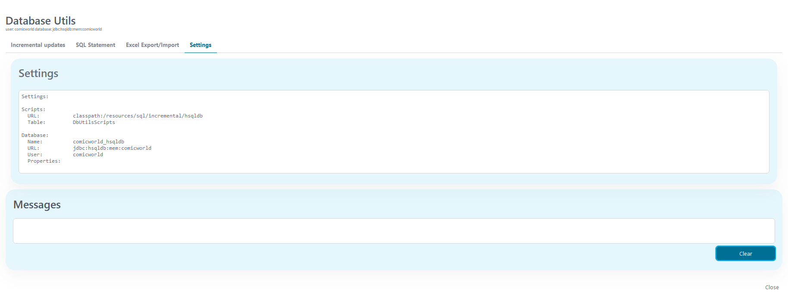

# DB-Utils

Db-Utils ist eine Sammlung von Tools, die Ihnen bei typischen Datenbankaufgaben
in Ihrem Projekt helfen. Es bietet Unterstützung für automatische, inkrementelle
SQL-Aktualisierungen von Datenbanktabellen, den Export und Import von Daten
sowie ein einfaches Datenbankabfragefenster. Unterstützung für Microsoft SQL und
HSQLDB ist standardmäßig enthalten, aber die Komponente lässt sich leicht für
andere Datenbanktypen erweitern.

## Konzepte

Die wichtigste Funktion von DB-Utils ist wahrscheinlich die automatische
Aktualisierung Ihrer Datenbank bei jeder Bereitstellung. Darüber hinaus können
Daten aus Ihren Datenbanken einfach in Excel- oder Zip-Dateien exportiert oder
importiert werden, und einfache Abfragen können direkt über eine DB-Utils-GUI
innerhalb Ihrer Anwendung ausgeführt werden. Durch die Definition eines
Resolvers für Ihre Projektkonfiguration, einiger Einstellungen in globalen
Variablen und möglicherweise eines Prozessstart-Ereignis-Beans können Sie alle
Funktionen von DB-Utils nutzen.

### Inkrementelle Updates

Db-Utils verwaltet eine Liste inkrementeller SQL-Skripte und deren
Ausführungsstatus zusammen mit Ihrem Projekt und der Datenbank Ihres Projekts.
Wenn Db-Utils zum ersten Mal ausgeführt wird (entweder über die GUI oder
automatisch beim Programmstart), erstellt es eine Tabelle, um diese Liste zu
verwalten. Der Tabellenname kann in Ihrer `DbUtilsResolver` überschrieben
werden, aber der Standardname lautet `DbUtilsScripts`. Dateien können manuell
über die Db-Utils-GUI oder automatisch bei jedem Start Ihrer Anwendung
ausgeführt werden. Die SQL-Skripte können in einem Dateisystemordner oder in
einem Ressourcenverzeichnis (classpath) gespeichert werden (was die bevorzugte
Methode ist). Gemäß einer Konvention werden SQL-Skripte in alphabetischer
Reihenfolge ihrer Dateinamen sortiert, angezeigt und ausgeführt. Es wird
empfohlen, die inkrementellen Dateien des Projekts im Klassenpfad Ihres Projekts
abzulegen, z. B. in einem Unterordner des Ordners „ `src` ” Ihres Projekts (z.
B. „ `src/resources/sql/incremental` ”) und bei der Benennung Ihrer Skripte
einem gemeinsamen Muster zu folgen, z. B.

`YYYYMMDD-HHMM-Ticket-Short-Description.sql`

Db-Utils erstellt eine Tabelle, um zu speichern, welche dieser SQL-Skripte
ausgeführt wurden, und bietet eine GUI, um die Liste der Skripte zusammen mit
ihrem Status anzuzeigen. Skripte können in dieser GUI ausgeführt, übersprungen
und allgemein verwaltet werden.

Zusätzlich können Sie eine `IProcessStartEventBean` definieren, um benötigte
(noch nicht ausgeführte) SQL-Skripte beim Start Ihrer Anwendung automatisch in
der richtigen Reihenfolge auszuführen. Diese `IProcessStartEventBean` kann
einfach durch Erweiterung von `AbstractDbUtilsStartEventBean` erstellt werden.
Beachten Sie, dass diese Bean im Kontext Ihrer Anwendung (oder abhängig von
Ihren Projekten) definiert werden muss, da sie Zugriff auf den Klassenpfad Ihrer
Projekte haben muss.

Beachten Sie, dass es auch einen zweiten Datenbank-Aktualisierungsmechanismus
gibt, der auf [Liquibase](https://liquibase.com) basiert.

### Inkrementelle Updates mit Liquibase

Es steht ein weiterer Mechanismus zur Datenbankaktualisierung zur Verfügung, der
auf [Liquibase](https://liquibase.com) basiert. Dazu müssen Sie lediglich eine
Änderungsprotokolldatei in Ihrer `DbUtilsResolver` definieren und, falls
gewünscht, eine StartEvent-Bean für automatische Aktualisierungen beim Start der
Anwendung implementieren. Weitere Informationen zu Liquibase finden Sie in der
offiziellen Dokumentation!

### SQL-Abfragen

Db-Utils bietet eine einfache GUI zur Ausführung von SQL-Skripten. Beachten Sie,
dass diese Skripte ohne jegliche Überprüfung und unter den Berechtigungen des
für Ihre Datenbank konfigurierten Benutzers „unverändert“ ausgeführt werden. Die
GUI zeigt die Ergebnisse in einem einfachen Textfenster an. Sie ist für schnelle
kleine Suchvorgänge oder Online-Korrekturen konzipiert und nicht mit einem
echten Datenbank-Tool vergleichbar.

### Excel-Export und -Import

Db-Utils bietet eine Export- und Importfunktion für Excel-Dateien und sogar
binäre BLOBS. Diese Funktion wird von [DbUnit](https://www.dbunit.org/)
implementiert.

**Der Export von Daten** en kann auf zwei Arten erfolgen:
* *Excel-* exportieren Exportieren Sie eine Excel-Datei mit einem Blatt pro
  Tabelle.
* *ZIP-Export* Exportieren Sie eine Excel-Datei mit einem Blatt pro Tabelle,
  aber exportieren Sie zusätzlich alle Spalten, die ein binäres Großobjekt
  (BLOB) darstellen, in eine eigene Datei. Die Excel-Datei und alle exportierten
  Dateien werden in einer ZIP-Datei gespeichert. In der ZIP-Datei werden die
  BLOB-Spaltendateien in Unterordnern mit der Namenskonvention
  `lob//<column>/file.ext` abgelegt.</column><table></table>

**Der Import von Daten** kann mit oder ohne vorherige Bereinigung der Datenbank
erfolgen. Beachten Sie, dass dies ein potenziell gefährlicher Vorgang ist, da
das Löschen von Einträgen nicht rückgängig gemacht werden kann. Der Import von
Daten sollte wahrscheinlich nur während Tests verwendet werden, um eine
Datenbank in einen definierten Testzustand zu versetzen, oder für die
Ersteinrichtung Ihrer Projektdatenbank auf einem neuen Rechner.
* *Laden Sie die Excel-* Laden Sie eine Excel-Datei im gleichen Format, wie es
  der Export erstellt.
* *Laden Sie Excel und verarbeiten Sie Classpath-Blobs* Derzeit kann eine zuvor
  exportierte ZIP-Datei nicht importiert werden, aber es wird eine Lösung
  angeboten, die sich bei der Projektentwicklung als nützlich erwiesen hat. Der
  Import lädt eine Excel-Datei im gleichen Format wie der Export ZIP,
  verarbeitet jedoch Classpath-Referenzen in Excel-Spalten. Wenn eine Spalte
  eine Classpath-Referenz enthält (`classpath:/path`), wird die Datei in den für
  DB-Utils definierten Datenressourcen gesucht und als Blob eingefügt. Es wird
  empfohlen, die BLOB-Dateien in einem Unterordner des src-Ordners Ihres
  Projekts abzulegen (z. B. `src/data`). Dabei wird davon ausgegangen, dass Sie
  nur wenige, sich selten ändernde BLOB-Testdateien in Ihrem Projekt zum Testen
  haben und nicht für jede Spaltenänderung in der importierten Excel-Datei
  während der Entwicklung ZIP-Dateien erstellen möchten.

Um ein Beispiel für die in Ihrem Projekt gespeicherten Ressourcen zu sehen,
sehen Sie sich bitte das Demo-Projekt `src/resources` an und vergleichen Sie es
mit den Einstellungen in den globalen Variablen (oder `DbUtilsResolver` für den
Microsoft SQL Server-Teil).

Beachten Sie, dass die Blätter in Ihrer Excel-Datei für den Import in der
richtigen Reihenfolge sein müssen, damit keine Einschränkungen verletzt werden.
Um die richtige Reihenfolge zu erhalten, exportieren Sie am besten zuerst die
Datenbank. Durch den Export wird eine Excel-Datei mit der richtigen
Blattreihenfolge erstellt.

Beachten Sie, dass Excel Beschränkungen hinsichtlich der maximalen Größe von
Spalten und Blättern hat. Diese Funktion kann für Tests oder die anfängliche
Einrichtung der Datenbank hilfreich sein, sollte jedoch nicht für
Datenbank-Backups und ähnliche „wichtige” Datenbankaufgaben verwendet werden.

### Einstellungen

Die Einstellungsseite zeigt einige grundlegende Datenbank-Einstellungen, um
herauszufinden, welche Datenbank verwendet wird. Sie kann später erweitert
werden.

### Unterstützung für mehrere Datenbanken

Es werden mehrere Datenbanken unterstützt. Jede Datenbank benötigt einen eigenen
Resolver und ein eigenes Prozessstart-Ereignis-Bean. Der Standardmechanismus zum
Abrufen der Konfiguration aus globalen Variablen kann natürlich nur für eine
Datenbank verwendet werden. Wenn Sie mehrere Resolver bereitstellen,
implementieren Sie auch die Verarbeitung unterschiedlicher Konfigurationen
(mithilfe von Konstanten, globalen Variablen usw.).

## Demo
<!--
We use all entries under the heading "Demo" for the demo-Tab on our Website, e.g. for the Connector A-Trust here: https://market.axonivy.com/a-trust#tab-demo  
-->

**Hinweis: Das Demo-Projekt muss entpackt werden, damit es im Axon Ivy Designer
ausgeführt werden kann.**


Die Demo zeigt, wie Sie Db-Utils in Ihr Projekt integrieren können. Sie enthält
die einfachstmögliche Konfiguration für eine HSQLDB und eine etwas
ausführlichere Konfiguration für eine Microsoft SQL Server-Datenbank. Der
HSQLDB-Teil läuft ohne zusätzliche Konfiguration sofort. Für den Microsoft SQL
Server-Teil benötigen Sie Zugriff auf eine Microsoft SQL Server-Datenbank und
müssen deren Anmeldedaten konfigurieren. Beachten Sie, dass Db-Utils
SQL-Anweisungen für diese Datenbank bedingungslos ausführt!

### Db-Utils GUI

Der Großteil der Demo kann in der Db-Utils-GUI angesehen werden. Die GUI verfügt
über Registerkarten für verschiedene Vorgänge und einen gemeinsamen
Meldungsbereich zur Anzeige der Ergebnisse. Um die GUI zu verwenden, verwenden
Sie den Benutzer „ `” dbadmin` oder erstellen Sie einen Benutzer mit der Rolle „
`” DbUtilsAdministrator`.

### Inkrementelle Updates

Die Registerkarte „ **Incremental Updates“ (Inkrementelle Updates für
SQL-Skripte) „** “ (Verfügbare Skripte) zeigt eine Übersicht über die
verfügbaren SQL-Skripte und eine Übersicht über Skripte, die einmal vorhanden
waren, aber nicht mehr als Ressourcen verfügbar sind. Für jedes Skript werden
das Ausführungsdatum, Fehler und ein Status angezeigt. Skripte können manuell
ausgeführt, aktualisiert, deaktiviert, ignoriert oder gelöscht werden (nur für
nicht verfügbare Skripte verfügbar).

Es stehen Shortcuts zur Verfügung, um alle Skripte auszuführen, die noch nicht
erfolgreich ausgeführt wurden, und sogar um im Falle von Fehlern die Fortsetzung
zu erzwingen.


### Inkrementelle Updates mit Liquibase

Die Registerkarte „ **“ (Liquibase-** ) bietet eine Schaltfläche zum Starten der
Liquibase-Aktualisierung. Fehler werden auf der Seite angezeigt.


### SQL-Anweisungen

Die Registerkarte „ **e SQL-Anweisungen“ (** ) kann verwendet werden, um
einfache SQL-Anweisungen für die Datenbank auszuführen. Die Ergebnisse werden im
Meldungsbereich angezeigt.


### Excel-Export/Import

Die Registerkarte „ **“ (Excel-Export/Import) unter „** “
(Datenbank-Einstellungen) dient dazu, die gesamte Datenbank in eine Excel- oder
ZIP-Datei zu exportieren oder die gesamte Datenbank (oder Teile davon) aus einer
Excel-Datei zu importieren. Beim Importieren können Sie auswählen, ob die
Datenbank vor dem Import bereinigt werden soll. Hinweis: Bei dieser Bereinigung
werden alle in der importierten Excel-Datei genannten Tabellen bedingungslos
bereinigt. Es ist möglich, inkrementell zu importieren, sofern Sie keine
Datenbankbeschränkungen verletzen.

Die Demo-Skripte von Db-Utils erstellen drei Demo-Tabellen und füllen diese mit
Daten. Um die Export-/Importfunktion auszuprobieren, können Sie die vorhandenen
Daten in eine Excel-Datei exportieren, dann zur Registerkarte „SQL-Anweisungen”
gehen und alle Daten in den drei Demo-Tabellen mit den unten angezeigten
Anweisungen löschen und anschließend die vorherige Excel-Datei erneut
importieren. Danach sollten die Daten wieder vorhanden sein.

```
delete from logo;
delete from hero;
delete from brand;
```

Zum Testen sind zwei Excel-Dateien enthalten.

* `export-with-blobs.xls` Eine Excel-Datei, die Daten für alle Tabellen und
  Binärdaten eines Blobs direkt enthält.
* `export-with-blobs-from-classpath.xls` Eine Excel-Datei, die Daten für alle
  Tabellen enthält, aber auf Binärdaten aus den Projektressourcen (classpath)
  verweist.


### Einstellungen

Die Einstellungen für „ **“ Die Registerkarte „** “ zeigt die aktuellen
Einstellungen, die von Db-Utils verwendet werden.



## Einrichtung
<!--
The entries under the heading "Setup" are filled in this tab, e.g. for the Connector A-Trust here: https://market.axonivy.com/a-trust#tab-setup. 
-->

Um DB-Utils in Ihr Projekt zu integrieren und zu verwenden, müssen Sie (für jede
Datenbank, die Sie unterstützen möchten)
* Stellen Sie eine Projekt-Local `-DBUtilsResolver-` -Klasse bereit.
* Stellen Sie eine Projekt-Local `-Klasse „DbUtilsStartEventBean” und eine
  Klasse „` ” bereit.
* Erstellen Sie einen Startprozess, der die DB-Utils-GUI aufruft.
* Erstellen Sie ein Programm, das mit „ `” DbUtilsStartEventBean startet.`
* Überprüfen Sie die Konfiguration.
* Sicherheit überprüfen

Im Demo-Projekt finden Sie Beispiele für eine einfache Einrichtung (HSQLDB-Teil)
und eine etwas komplexere, angepasste Einrichtung (Microsoft SQL Server-Teil).
Bitte vergleichen Sie die folgende Beschreibung mit diesen Beispielen.

### Stellen Sie `DbUtilsResolver bereit.`

Der DbUtilsResolver wird verwendet, um alle Konfigurationsinformationen für eine
der in Ihrem Projekt definierten Datenbanken zu speichern (z. B. Name,
Ressourcenpfade, DBUtilsScript-Tabellendefinition ...). Es ist wichtig, dass
diese Klasse in einem Projekt implementiert wird, das entweder Ihre Datenbank-
und Skriptressourcen definiert oder eine Abhängigkeit zu einem Projekt hat, das
diese definiert. Sie kann durch Erweiterung der von DB-Utils bereitgestellten
Klassen „ `“, „AbstractDbUtilsResolver“ und „` “ implementiert werden.
Implementierungen für Microsoft SQL Server (`MSSQL2005DbUtilsResolver`) und
HSQLDB (`HSQLDbUtilsResolver`) werden direkt von DB-Utils bereitgestellt.

### Stellen Sie DbUtilsStartEventBean und/oder LiquibaseStartEventBean bereit.

Die `DbUtilsStartEventBean` und/oder `LiquibaseStartEventBean` werden als
Java-Klasse beim Start eines Ereignisprozesses verwendet. Sie sollten
`AbstractDbUtilsStartEventBean` erweitern, das von DB-Utils bereitgestellt wird,
und einen Standardkonstruktor implementieren, der die Projekte `DbUtilsResolver`
festlegen muss.

### Db-Utils-GUI-Prozess starten

Erstellen Sie einen Startprozess, der die Db-Utils-GUI (und die Projekte
`DbUtilsResolver`) verwendet, die vom Db-Utils-Projekt bereitgestellt werden
(siehe unten). Beachten Sie, dass Sie diesen Start durch eine autorisierte Rolle
des Projekts sichern sollten!


### Programm erstellen Start

Erstellen Sie einen Programmstart, der die Projekte „ `” und
„DbUtilsStartEventBean”` (siehe unten) verwendet.


### Konfiguration

Klassen, die `erweitern, AbstractDbUtilsResolver` können über globale Variablen
konfiguriert werden. Die wichtigsten globalen Variablen (Einstellungen) sind:
* Name der Datenbank, wie in der Ivy-Datenbankkonfiguration definiert.
* Die Skript-URL zum Auffinden inkrementeller SQL-Skripte. Diese Skripte können
  sich im Dateisystem befinden, aber es ist praktischer, sie als Ressource in
  Ihr Projekt einzufügen, indem Sie das Classpath-Schema in der URL verwenden.
  Auf diese Weise werden sie automatisch bereitgestellt und sind immer auf dem
  neuesten Stand Ihres Projekts.
* Die Daten-URL wird für andere Daten verwendet, z. B. für Binärdateien, die in
  Excel-BLOB-Importen verwendet werden können.
* Zusätzliche Einstellungen zum Konfigurieren automatischer Updates und zum
  Aktivieren oder Deaktivieren von GUI-Registerkarten

Bitte sehen Sie sich das Demo-Projekt an, um den für SQL-Skripte und
Blob-Dateien verwendeten Klassenpfadmechanismus besser zu verstehen.

```
@variables.yaml@
```

### Sicherheit

Db-Utils kann verwendet werden, um beliebige SQL-Skripte ohne weitere
Überprüfungen direkt in der konfigurierten Datenbank mit den Berechtigungen des
konfigurierten Benutzers auszuführen. Daher ist es wichtig, den Start der
Db-Utils-GUI mit einer erhöhten Rolle in Ihrem Projekt zu sichern
(`DbUtilsAdmin` oder ähnliches). Zusätzlich ist es möglich, jede Registerkarte
(Funktionalität) in der Db-Utils-GUI durch Konfiguration zu deaktivieren.

Um die automatische Update-Funktion von Db-Utils nutzen zu können, benötigt der
konfigurierte Datenbankbenutzer höchstwahrscheinlich erweiterte
Datenbankberechtigungen (z. B. zum Ändern von Tabellendefinitionen), die Sie
möglicherweise nicht in Ihrer Anwendung haben möchten.

In diesem Fall könnte es eine Idee sein, je nach Ihren Projekten ein separates
Projekt (z. B. ein Tools-Projekt) zu erstellen und alle Db-Utils-spezifischen
Implementierungen sowie eine spezielle, erweiterte Datenbankkonfiguration in
diesem separaten Projekt unterzubringen.


